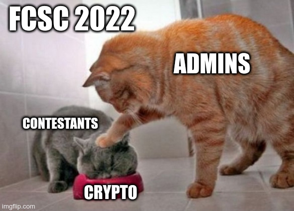

# FCSC 2022 Chatpristi 1/2

Un ami m'a fourni un site pour stocker mes memes, et il me dit qu'il y a deux flags cachés dedans. Pouvez-vous m'aider à les trouver ?

Pour cette première épreuve, votre but est de trouver un meme caché.

Cette épreuve est composée de deux parties :
- **Chatpristi 1/2**.
- Chatpristi 2/2.

Auteur : [Cryptanalyse](https://twitter.com/Cryptanalyse)

Origine : [Chatpristi 1/2](https://hackropole.fr/fr/challenges/web/fcsc2022-web-chatpristi-1/)

-----------

## Installation manuel
Vous n'utilisez pas l'application **les CTFs de Cyrhades** ? C'est dommage !
Mais voici comment installer ce CTF manuellement :

> git clone https://github.com/Hack-Oeil/fcsc2022-web-chatpristi.git

> cd fcsc2022-web-chatpristi

-----------

## Sur le site officiel hackropole.fr
> https://hackropole.fr/fr/challenges/web/fcsc2022-web-chatpristi-1/